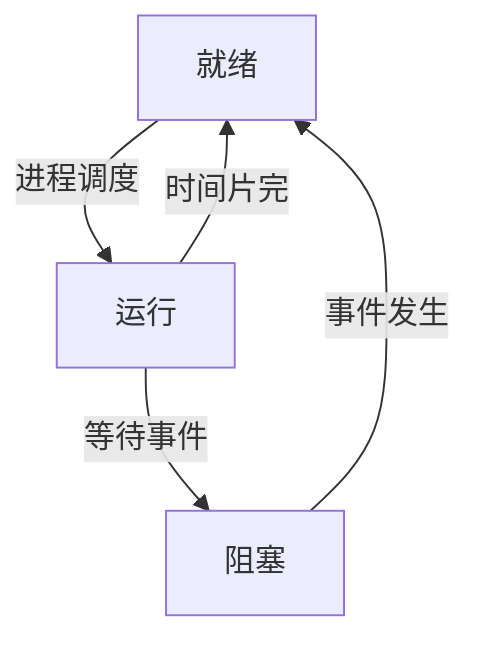

# 进程和线程

进程（process）和线程（thread）是操作系统的基本概念，它们都比较抽象，所以理解起来并不容易。但是弄清进程和线程的概念，对我们理解程序的运行至关重要。

## 程序

**程序**：计算机为完成特定任务所执行的指令序列，以文件的形式存储在磁盘中。

对程序的管理是操作系统的主要工作之一，在 `Windows` 中，大多数可执行程序的扩展名是 `.exe`，少部分也有 `.com`。

| 常用应用程序 | 文件名 |
| :-- | :-- |
| Windows 资源管理器 | explorer.ext |
| 记事本 | notepad.ext |
| 写字本 | write.exe |
| 画图 | mspaint.ext |
| 命令提示符 | cmd.ext |
| Windows Media Player | iexplore.ext |
| Internet Explorer | msimn.ext |

## 进程与线程

操纵系统的重要任务之一就是使用户充分而有效地利用系统资源，并发性是操作系统最主要的特征。

**处理机进行资源分配调度的单位可为进程或线程，而处理机的管理也称为进程的管理。**

进程可以更好的描述计算机程序的执行过程，反应操作系统的并发执行、资源共享及用户随机访问的特性，并以此作为资源分配的基本单位。

操作系统的基本任务就是对进程实施管理，有效的控制进程的执行，给进程分配所需要的资源，允许进行之间共享和交换信息，并保护每个进程在运行期间不受其他进程的干扰，允许进程进行同步执行。

### 进程

并发性是操作系统的主要特性之一，是程序的并发执行。但是程序执行时所产生的问题使得传统的程序概念已经不足以对其进行描述，为此，引入了进程的概念。

**进程是程序的一次执行过程，是操作系统资源分配的基本单位。**

每当用户运行一个程序时，操作系统就为该程序创建一个进程，并为它分配资源、调度其运行。

进程可以很好的描述程序的执行过程，反映操作系统的并发执行、资源共享及用户随机访问的特性。

程序执行结束后，进程也就消亡。

就绪状态：除 CPU 外的一切资源。
阻塞状态：可能需要调用其他的物理设备等情况就会进入该状态。

### 进程和程序的区别

进程的实质就是程序的执行过程，是一个动态的过程。而程序则是描述问题解题步骤和方法的指令集合，是静态的。

进程的生命是短暂的，在程序执行初期被创建，执行结束后销毁，而程序的存在是永久的。

进行是一个能够独立调度并能和其他进程进行并行执行的单位，能确切地描述并发执行，程序不能作为独立调度执行单位。

一个程序可以多次执行并产生多个不同的进程，而一个进程只对应一个程序。

### 线程

在 Windows 系统中，**线程是一个进程内的基本调度单位，以此作为 CPU 分配的基本单位，而进程是（除 CPU 外）资源的分配单位**。

引入线程的目的是为了提高操作系统并发执行的程度，从而进一步提高系统的吞吐量，减少程序并发执行时所付出的时间和空间的开销。

单线程在程序执行时，所走的程序路径按照连续顺序排下来，前面的必须处理好，后面的才会执行。

多线程能有效提升 CPU 的利用率，但是创建多线程需要更多的内存空间，而且会影响性能，因为操作系统需要在它们之间切换。

单线程较多线程来说，系统稳定、扩展性极强、软件丰富。多用于点对点的服务。

### 进程与线程的关系

一个进程至少拥有一个线程。根据需要，一个进程也可以同时创建多个线程。

进程中所有线程共享该进程中的资源。驻留同一块内存空间，可以访问相同的数据。当一个线程改变了内存中某个单位的数据时，其他线程在访问该数据单元时会共享变化后的数据。

## 总结

* 计算机为完成特定任务所执行的指令序列，以文件的形式存储在磁盘中。
* 进程是计算机程序的执行过程，是除 CPU 外资源分配的基本单位。
* 线程是 CPU 调度的基本单位。

## 参考资料

* [大学计算机_大连理工大学](https://www.icourse163.org/course/DLUT-1001938002)
* [进程与线程的一个简单解释 - 阮一峰的网络日志](http://www.ruanyifeng.com/blog/2013/04/processes_and_threads.html)
* [进程和线程 - 廖雪峰的官方网站](https://www.liaoxuefeng.com/wiki/0014316089557264a6b348958f449949df42a6d3a2e542c000/0014319272686365ec7ceaeca33428c914edf8f70cca383000)
