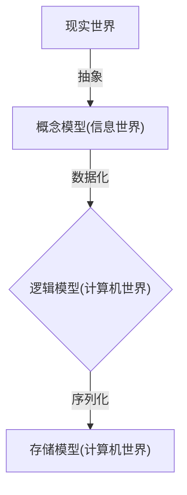

# 基础概述


当今信息社会离不开信息系统，而信息系统的核心就是数据库系统。

**数据库技术**，是研究数据的存储、设计和使用的技术，简而言之可视为电子化的文件柜——存储电子文件的处所，用户可以对文件中的数据进行新增、截取、更新、删除等操作。

现如今数据库技术已经被广泛应用于各个领域。

## 相关概念

**数据**(Data)：描述事物的符号记录称为数据，表现为文字，图形，图像，声音，语言等。

**数据库**(DataBase, 简称 DB)：长期存储在计算机内的、有组织的、可共享的数据集合(数据库中的数据按一定的数据模型组织、描述和存储，具有较小的冗余度，和较高的数据独立性和易扩展性，并可为各种用户共享)。

**数据库管理系统**(DataBase Management System, 简称 DBMS)：位于用户和操作系统之间的一层数据管理软件。其主要功能包括以下几点：

- 数据定义(Data Definition Language)
- 数据操作(Data Manipulation Language)
- 数据库的运行管理(统一管理、统一控制、保证安全、完整、并发使用及故障恢复)
- 数据库的建立和维护功能(初始数据输入，数据库转储、恢复，数据库重组织、性能监视、分析等)

**数据库系统**(DataBase System, 简称 DBS)：在计算机系统中引入数据库后的系统，一般由数据库、数据库管理系统(及其开发工具)、应用系统、数据库管理员(DataBase Administrator, 简称 DBA)和用户构成。它包含有以下几个特点：

- 采用复杂的结构化的数据模型
- 最低的冗余度
- 有较高的数据独立性(用户面对的是简单的逻辑结构操作而不涉及数据具体的物理存储结构)
- 安全性(设置用户的使用权限；在数据库被破坏时，系统有能力把数据库恢复到可用状态)
- 完整性(系统采用一些完整性检验以确保数据符合某些规则，保证数据库中数据始终是正确的)

## 数据管理技术的发展

数据库技术是应数据管理任务的需要而产生的，是数据管理的最新技术，是计算机科学的重要分支。

数据管理技术的发展主要经历了人工管理阶段、文件系统阶段、数据库系统阶段三个阶段。

|                  | 人工管理阶段   | 文件系统阶段         | 数据库系统阶段       |
| :--------------- | :------------- | :------------------- | :------------------- |
| **数据存储方式** | 数据不保存     | 保存在文件中         | 保存在数据库中       |
| **数据组织方式** | 由程序自己决定 | 以记录为单位进行组织 | 数据结构化(数据模型) |
| **数据独立性**   | 与程序不独立   | 有一定的独立性       | 独立性强             |
| **数据共享性**   | 共享性差       | 有一定的共享性       | 共享性好             |
| **数据冗余度**   | 冗余度大       | 冗余度较大           | 冗余度低             |

## 数据模型

数据模型是现实世界数据特征的抽象。在数据库中，用数据模型来抽象、表示和处理现实世界中的数据和信息，其要求包括能比较真实地模拟现实世界、容易为人所理解、便于在计算机上实现。



逻辑模型是面向数据库的，重点描述在数据库中的实现，从概念模型到逻辑模型是数据库设计人员完成的，而存储模型(物理模型)是面向计算机的，主要在于给出数据模型在计算机中的物理结构的表示，这是由数据库管理系统来完成的任务。

概念模型独立于计算机系统之外，着重和客观的对现实世界中的复杂事物及其相互之间的关系进行描述，它是按照用户的观点来对数据和信息建模，主要用于数据库的设计。涉及的相关概念包括：

- **实体**：客观存在并可相互区别的事物，可以是具体的人或事物，也可以是抽象的概念或事件。
- **实体属性**：实体所具有的特性称为实体属性。一个实体可以由若干个属性来描述。
- **实体属性值**：实体属性的具体化表示，属性值的集合表示一个实体。
- **实体类型**：用实体名及所有属性集合表示同类实体，简称实体型。
- **实体集**：具有相同属性的实体集合。
- **联系**：事物内部及事物之间的联系，即实体内部的联系以及实体之间的联系，实体之间的联系包括：一对一、一对多和多对多。
- **E-R 模型**：提供不受任何 DBMS 约束的面向用户的表达方法。其中矩形表示实体集(型)，椭圆表示属性，菱形表示联系。

## 常用的数据模型

数据模型的三要素：

- **数据结构**：主要描述数据类型、内容以及数据间的联系等，即数据存储的静态性。
- **数据操作**：主要规定对数据模型中数据和联系所允许的操作以及操作规则，即描述数据模型的动态性。
- **数据完整性约束**：关系数据模型有实体、参照和用户定义三类完整性约束条件，前两种完整性是关系数据模型必须满足的约束条件，也称为关系的两个不变性条件，由关系数据库管理系统自动支持。

常见的数据模型包括：

- **层次模型**(Hierarchical Model)：通过树形结构表示实体及联系，每个结点表示一个实体(型)，箭头表示实体(型)间的联系(由父到子)。
- **网状模型**(NeTWork Model)：通过网状结构表示实体及联系，“网”中的每个结点表示一个实体(型)，结点之间箭头表示实体(型)间的联系。
- **面向对象模型**(Object Oriented Model)：将现实中的所有实体都模拟成对象，再将一个对象的相关数据和代码封装到一起成为二个单元，通过消息完成对象之间的沟通，对象接口是一个所允许的消息集合。
- **关系模型**(Relational Model)：用二维表描述实体型，一张二维表就是一个关系，表中记录表示实体。

关系数据模型涉及的基本术语：

- **关系**(Relation)：一个关系对应通常说的一张表。
- **元组**(Tuple)：表中的一行，也成为记录。
- **属性**(Attribute)：表中的一列。每个属性需要有一个名称，即属性名。也成为字段。
- **主键**(Key)：表中的某个属性组，可以唯一确定一个元组。
- **值域**(Domain)：属性(字段)的取值范围。
- **分量**：元组中的一个属性值。
- **关系模式**：对关系的描述，是二维表的框架结构，表示为 `关系名（属性，属性2，……属性n）`。

## SQL 基础

**结构化查询语言**(Structured Query Language, 简称 SQL)是用于访问和处理数据库的标准的计算机语言，同时也是数据库脚本文件的扩展名。

SQL 的功能分为四个部分：

- **数据定义功能**：用于定义、修改和删除数据库中的对象(表)，关键字为：`CREATE`、`ALTER`、`DROP`。
- **数据操纵功能**：用于增加、修改和删除数据库中的数据，关键字为：`INSERT`、`UPDATE`、`DELETE`。
- **数据查询功能**：用于查询数据库中满足条件的数据，关键字为：`SELECT`。
- **数据控制功能**：用于控制对数据库操作的权限，关键字为：`GRANT`、`REVOKE`。

SQL 的常用语句：

- `CREATE TABLE` 语句：用于创建数据库中的表，表由行和列组成，每个表都必须有个表名。

```bash
CREATE TABLE table_name
(
column_name1 data_type(size),
column_name2 data_type(size),
column_name3 data_type(size),
....
);
```

关系模式中的属性对应基本表的字段，由上可见在定义表结构时，必须确定每个字段的数据类型，如需了解 `MySQL` 和 `SQL Server` 中可用的数据类型可访问 [数据类型参考手册](http://www.runoob.com/sql/sql-datatypes.html)。

- `ALTER TABLE` 语句：用于在已有的表中添加、删除或修改列，该语句只能同时添加或删除一条语句。

```bash
# 在表中添加列
ALTER TABLE table_name
ADD column_name datatype
# 删除表中的列
ALTER TABLE table_name
DROP COLUMN column_name
# 改变表中列的数据类型(mysql)
ALTER TABLE table_name
MODIFY COLUMN column_name datatype
```

- `DROP TABLE` 语句：用于删除已建立好的表。

```bash
DROP TABLE table_name
```

- `INSERT INTO` 语句：用于向表中插入新记录。

```bash
# 第一种形式无需指定要插入数据的列名，只需提供被插入的值
INSERT INTO table_name
VALUES (value1,value2,value3,...);
# 第二种形式需要指定列名及被插入的值
INSERT INTO table_name (column1,column2,column3,...)
VALUES (value1,value2,value3,...);
```

- `DELETE` 语句：用于删除表中的行。

```bash
# WHERE 子句规定哪条记录或者哪些记录需要删除。如果您省略了 WHERE 子句，所有的记录都将被删除
DELETE FROM table_name
WHERE some_column=some_value;
```

- `UPDATE` 语句：用于更新表中已存在的记录。

```bash
# WHERE 子句规定哪条记录或者哪些记录需要更新。如果您省略了 WHERE 子句，所有的记录都将被更新
UPDATE table_name
SET column1=value1,column2=value2,...
WHERE some_column=some_value;
```

- `SELECT` 语句：用于从数据库中选取数据，结果被存储在一个结果表中，称为结果集。

```bash
# 使用 * 代替属性名则表示查询所有属性
SELECT column_name,column_name FROM table_name;
```

::: tip

- SQL 对大小写不敏感：SELECT 与 `select` 是相同的(示例中大写关键字，小写自定义信息)。
- 某些数据库系统要求在每条 `SQL` 语句的末端使用分号，以分隔每条 `SQL` 语句。

:::

## 参考资料

- [SQL 教程](http://www.runoob.com/sql/sql-tutorial.html)
- [大学计算机\_大连理工大学](https://www.icourse163.org/course/DLUT-1001938002)
